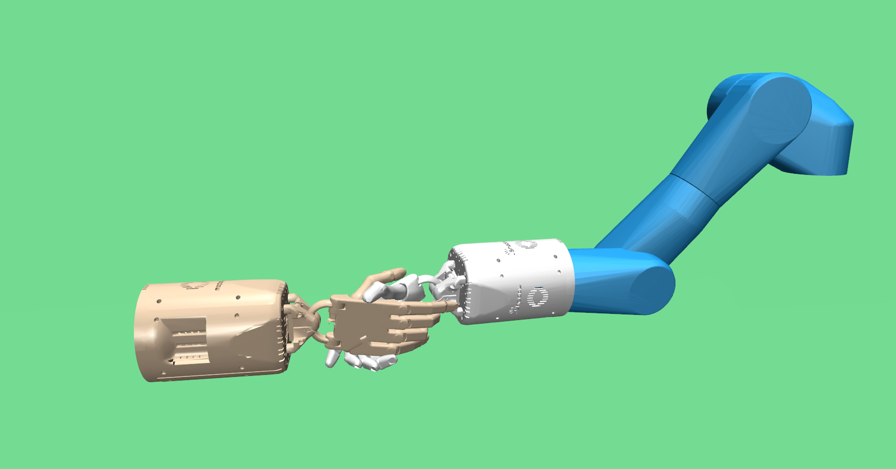
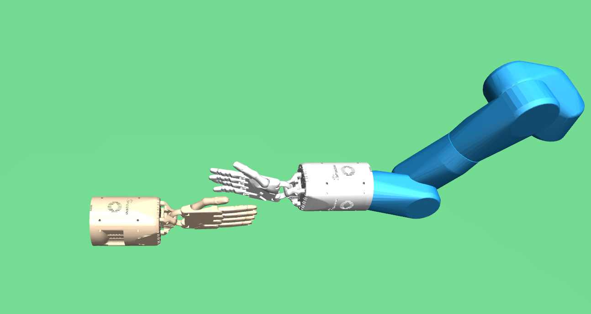
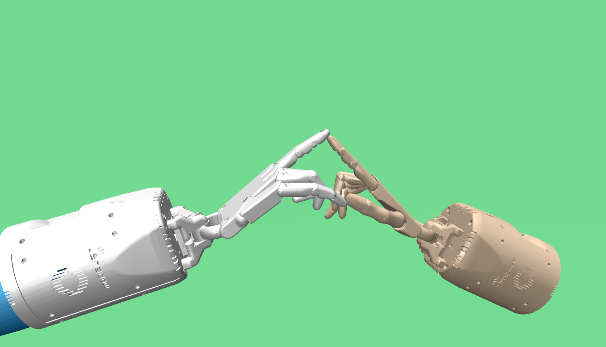

# Human-Robot Interaction


If you use these environments, please cite the following paper:

```
@inproceedings{christen2019drlhs,
  title={Demonstration-Guided Deep Reinforcement Learning of Control Policies for Dexterous Human-Robot Interaction},
  author={Christen, Sammy and Stevsic, Stefan and Hilliges, Otmar},
  booktitle={International Conference on Robotics and Automation (ICRA)},
  year={2019}
}
```

## Environments

[HriHandshake-v0](): Robot has to shake hands with the target human hand



[HriHandclap-v0](): Robot has to perform a handclap with the target human hand



[HriEt-v0](): Robot has to perform a finger touch (E.T.) with the target human hand


